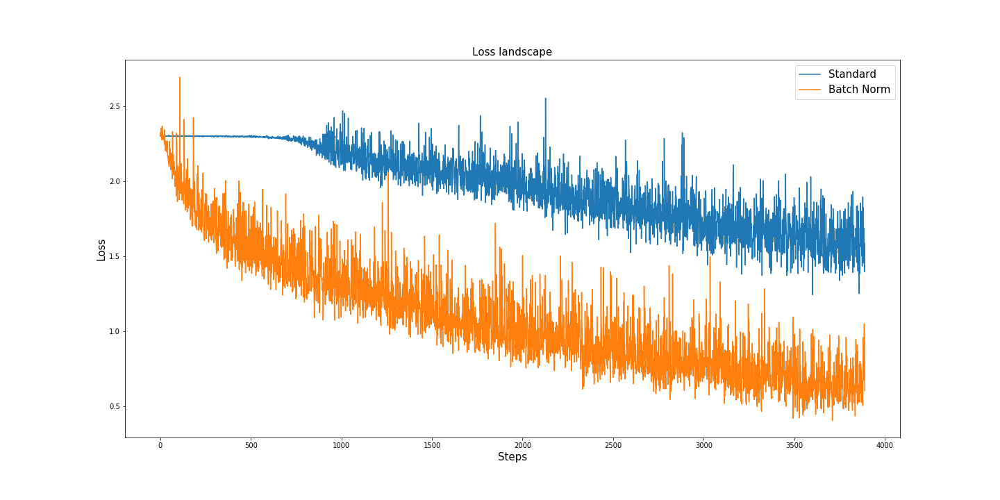

# Test batch norm paper
In this repo, you can find two notebooks in which I tested the results of "How does batch normalization help optimization?" paper ([link](https://arxiv.org/abs/1805.11604))

Batch normalization is a great technique to improve the performance of a deep neural network but despite the title of the original 2015 paper ([Batch Normalization: Accelerating Deep Network Training by Reducing Internal Covariate Shift](https://arxiv.org/abs/1502.03167)) the reduction of the Internal Covariate Shift seems to have little or nothing to do to the goodness of this method. 

## Test setup
- Pytorch VGG model config A with and without the batch norm layer after the 4th Conv layer
- Xavier uniform initialization
- Cross-Entropy loss
- SGD optimizer
- CIFAR 10 dataset
- lr = 0.01

## ICS
In my testings, the internal covariate shift in the batch norm model was almost always higher compared to the model without batch norm...

but the performance boost was obvious 

## Why does Batch Norm work?
The real reasons because batch normalization works are due to the higher gradient predictiveness and the more stable loss results. Being more confident with the direction of the gradients and having improved losses gives you the opportunity of increasing the learning rates and a faster and less sensitive to hyperparameter choices training.

## Gradient predictiveness 
The gradient predictiveness calculated as the norm 2 of (old_grad + new_grads) is clearly higher in the first stage of the training in the batch norm model

## Losses
The loss landscape of the batch norm model is a little smoother

